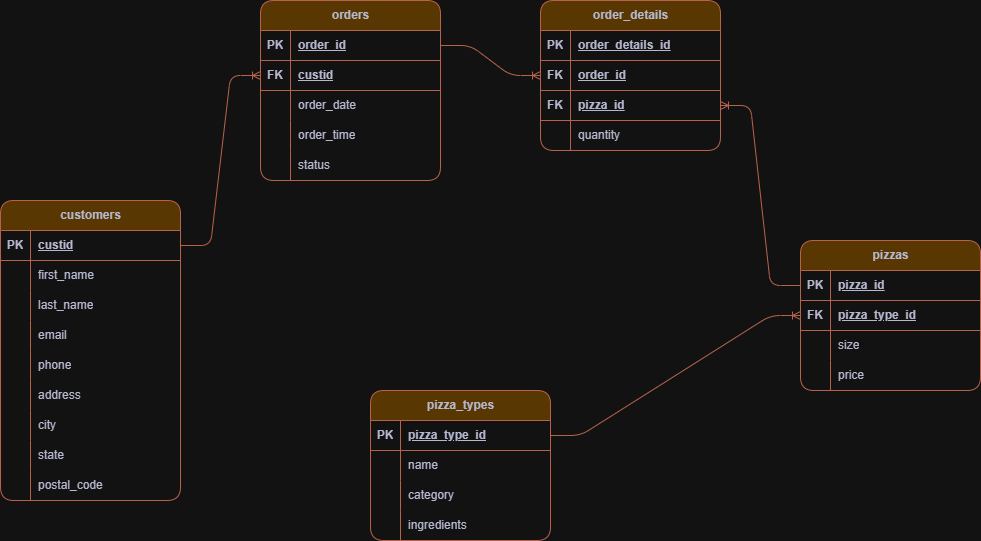

  

# NovaSlice Pizza SQL Analysis Project

## 1. Project Overview

NovaSlice Pizza is a fictional pizza chain operating across major Indian cities.  
This project delivers a full SQL based analysis of its transactional order data, simulating the type of analytics work carried out inside real food delivery or quick service restaurant operations.

It includes schema creation, data loading, and a structured set of stakeholder driven business questions, followed by revenue, product mix, customer behaviour, and operational insights.

The analysis demonstrates skills expected from an entry level data analyst including relational modelling, window functions, aggregation techniques, time based analysis, customer segmentation, and clear project documentation.

## 2. Business Context

NovaSlice Pizza operates a network of delivery focused outlets across multiple Indian cities.  
Management wants to better understand order behaviour, revenue drivers, customer patterns, and category level performance in order to support decisions related to menu strategy, staffing, marketing, pricing, and supply chain planning.

This analysis simulates a real internal analytics request where different stakeholders such as Operations, Finance, Marketing, Product, Customer Insights, and the Board ask specific questions about business performance.

All twenty SQL queries in this project are aligned with real business needs such as understanding order volume trends, identifying top selling pizzas, measuring customer loyalty, quantifying revenue contribution, and determining peak ordering periods.

## 3. Dataset Structure

The project uses five CSV files that represent the core transactional data for NovaSlice Pizza.  
These files were imported into SQL Server and modelled into a clean relational structure.

### Tables

**customers**  
Customer level information including name, contact details, city, and postal code.

**orders**  
One record per order placed by a customer. Contains order date, time, status, and customer reference.

**order_details**  
Line level detail for each order. Contains one row per pizza sold along with quantity.

**pizzas**  
Menu level information for each pizza including size and price.

**pizza_types**  
Descriptive attributes such as pizza category and ingredients.

The schema for these tables is defined in `schemas/schema.sql`.

## 4. Entity Relationship Diagram

The NovaSlice database follows a clean relational structure with five core tables.  
The ERD captures how customer information, orders, pizzas, and order line items interact.

### Relationship Summary

• One customer can place many orders  
• One order can contain many order line items  
• One pizza can appear in many order line items  
• One pizza type can define many pizzas

### Relationship Details

**customers → orders**  
- Relationship type: One to many  
- Each customer may have multiple orders, but each order belongs to a single customer.  
- Key: customers.custid → orders.custid

**orders → order_details**  
- Relationship type: One to many  
- Each order can contain multiple pizza line items.  
- Key: orders.order_id → order_details.order_id

**pizzas → order_details**  
- Relationship type: One to many  
- Each pizza can appear across many orders.  
- Key: pizzas.pizza_id → order_details.pizza_id

**pizza_types → pizzas**  
- Relationship type: One to many  
- A pizza type defines category and ingredients for multiple pizzas.  
- Key: pizza_types.pizza_type_id → pizzas.pizza_type_id

### ERD File

The full ERD diagram is stored at:

`erd/novaslice_erd.png`

  

## 5. Business Questions Answered

This project answers a set of real business questions across operations, finance, marketing, product strategy, and customer analytics.  
Each question maps to one or more SQL sections in `sql/sql_analysis.sql`.

### Orders and operational insights  

1. How many unique orders have been placed and how does order volume change month over month  
2. Which days and times of day have the highest or lowest ordering activity and how weekends compare to weekdays  
3. What is the average number of orders per customer and who are the key repeat customers driving volume  
4. How large a typical order is in terms of pizzas per order  
5. How many pizzas are ordered per day on average and how this pattern changes across months  

### Revenue and financial insights  

6. What the total revenue generated from all pizzas sold is  
7. Which pizzas generate the most revenue overall  
8. What percentage of total revenue each pizza contributes  
9. How cumulative revenue has grown over time  
10. How much revenue each pizza size contributes  

### Product and menu insights  

11. Which pizza is priced the highest and what its attributes are  
12. Which pizza size is ordered most often  
13. Which five pizza types sell the most units  
14. How many units are sold in each category and which categories dominate sales  
15. Within each category which three pizzas generate the most revenue  

### Customer and marketing insights  

16. Which customers spend the most overall and how their behaviour compares to others  
17. How customers segment into high value and regular groups based on total spend  
18. What proportion of customers are repeat customers versus one time buyers and what the repeat rate is  
19. How ordering patterns differ between weekdays and weekends from a marketing perspective  
20. How these patterns can inform loyalty, retention, and campaign planning  

These questions form the analytical backbone of the NovaSlice Pizza project and align with real world business needs for a food delivery or restaurant chain.

## 6. SQL Approach

The SQL workflow for NovaSlice follows a structured sequence that mirrors how an analyst would approach a real business data request.  
All analysis is performed inside Microsoft SQL Server.

### Workflow Steps

**1. Load schema and create tables**  
Run the DDL script in `schemas/schema.sql` to create all five tables and enforce primary and foreign key constraints.

**2. Import raw CSV data**  
Load the CSV files located in the `data/` folder into their respective tables using SQL Server import tools.

**3. Validate the data**  
Check row counts, duplicates, null values, and datatype consistency to ensure the dataset is ready for analysis.

**4. Execute analytical queries**  
Run each section (1 to 20) from `sql/sql_analysis.sql` individually.  
Each section corresponds to a business question and is fully documented inside the script.

**5. Capture query outputs**  
Screenshots of each query result set are saved in the `screenshots/` directory for transparency and reproducibility.

**6. Reference results in reporting**  
Selected outputs (such as revenue trends, customer behavior, and product performance) are summarized in the Insights section later in the README.

This workflow mirrors the structure of real analytics projects where schema creation, cleaning, exploration, and insights follow a repeatable pipeline.

## 7. Key Insights

This analysis highlights important trends across customer behavior, product performance, and financial outcomes. The insights below summarize what a business stakeholder would take away from the results of the queries.

### Operational Performance
Orders showed a consistent upward trend across months, indicating stable growth.  
Weekends accounted for noticeably higher order volumes compared to weekdays.  
Peak ordering hours were concentrated in the evening period, which has staffing and inventory implications.

### Product and Menu Performance
Classic and Supreme style pizzas contributed the highest unit sales across categories.  
Medium and large sized pizzas dominated most customer orders, while XXL sizes contributed very little volume.  
A small subset of pizza types contributed a disproportionately high share of both units sold and revenue.

### Revenue Insights
Revenue grew steadily month over month in cumulative form.  
The top three pizzas contributed a large share of total revenue, confirming a highly skewed revenue distribution.  
Certain categories consistently generated higher revenue per unit, signaling strong pricing power.

### Customer Insights
A minority of customers placed multiple orders and contributed significantly to total revenue.  
High value customers were identifiable through total spend, enabling future loyalty or retention campaigns.  
The repeat customer rate indicated a measurable opportunity for improving retention and customer lifetime value.

These insights demonstrate how SQL analysis can directly support marketing, product, operations, and finance functions in a food ordering business.

## 8. Screenshots of Outputs

All SQL query results for the twenty business questions have been captured as PNG files.  
They are stored inside the `screenshots` folder in this repository.

Each file name follows a clear naming convention that matches the section numbers in the SQL script  
(for example: `section01_1_1_total_unique_orders.png`, `section05_top5_pizza_types.png`, etc.)

Below is a small preview of selected SQL query outputs.  
All screenshots are available in the folder: `screenshots/`

### Preview

  
  

  
  

## 9. How to Run This Project

To reproduce the full analysis on your own machine, follow the steps below.

### 1. Clone the Repository
Clone the project to your local machine:
git clone https://github.com/<your-user>/novaslice_sql_analysis.git

### 2. Open Microsoft SQL Server
Ensure that SQL Server and SQL Server Management Studio (SSMS) are installed.

### 3. Create the Database (optional)
CREATE DATABASE novaslice;
USE novaslice;

### 4. Run the Schema Script
Open `schemas/schema.sql` and run the full script to create all five tables and their relationships.

### 5. Import the CSV Data
Use SSMS  
Tasks → Import Flat File and import all files from the `data/` folder into their matching tables:
customers  
orders  
order_details  
pizzas  
pizza_types

### 6. Run the Analysis Script
Open `sql/sql_analysis.sql` and run each section individually.  
Each section corresponds to one business question.

### 7. View Outputs
All expected outputs are available in the `screenshots/` folder for cross checking.

## 10. Caveats and Data Quality Notes

Although the dataset is clean and suitable for learning projects, several real world limitations apply:

• The dataset represents a simplified model of restaurant ordering  
• No missing values or inconsistent formats are present, which is uncommon in production databases  
• Pricing is static and does not reflect dynamic discounts or promotions  
• Customer table fields such as phone numbers and addresses are synthetic  
• No geographic hierarchy (state → city) is enforced through reference tables  
• Order status values are limited and may not represent a full delivery workflow

These caveats are important to acknowledge when presenting the project to recruiters or hiring managers.

## 11. Project Files

This repository is organized into the following folders:

• data/: raw CSV files  
• schemas/: database schema creation script  
• sql/: main SQL analysis script  
• screenshots/: images of query results and logo  
• erd/: entity relationship diagram  
• caveats/: data_quality_and_caveats.md with detailed assumptions and limitations

Each file contributes to a complete, reproducible SQL analysis workflow.

## 12. About the Analyst

This project was completed by Adnan Haider as part of a structured portfolio of analytics work.  
The goal is to demonstrate strong SQL fundamentals, analytical thinking, and the ability to translate  
raw data into business facing insights.

Adnan specializes in SQL based analysis, Power BI dashboards, Python EDA, and end to end analytics projects.  

LinkedIn: www.linkedin.com/in/adnan-haider-dev
GitHub: [https://github.com/AdnanMGHaider](https://github.com/AdnanMGHaider)
