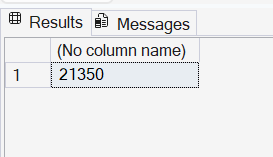
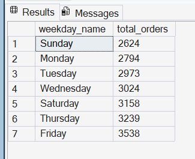
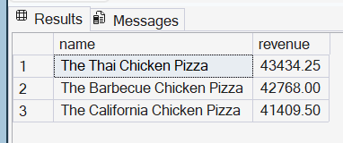

  

# NovaSlice Pizza SQL Analysis Project

## 1. Project Overview

NovaSlice Pizza is a fictional pizza chain operating across major Indian cities.  
This project delivers a complete SQL based analysis of one full cycle of transactional order data.  
The goal is to recreate the type of analytics work performed inside a real food delivery or quick service restaurant environment.

The project covers the complete workflow  
from data loading and schema creation  
to business question framing, stakeholder oriented queries,  
and a full breakdown of revenue, product mix, customer behaviour,  
and operational trends.

This analysis demonstrates core skills expected from an entry level data analyst  
including relational modelling, window functions, aggregation techniques,  
time based analysis, customer segmentation, and structured project presentation.

## 2. Business Context

NovaSlice Pizza operates a network of delivery focused outlets across multiple Indian cities.  
Management wants to better understand order behaviour, revenue drivers, customer patterns,  
and category level performance in order to support decisions related to menu strategy,  
staffing, marketing, pricing, and supply chain planning.

This analysis simulates a real internal analytics request where different stakeholders  
Operations, Finance, Marketing, Product, Customer Insights, and the Board  
ask specific questions about business performance.

All twenty SQL queries in this project are aligned with real business needs  
such as understanding order volume trends, identifying top selling pizzas,  
measuring customer loyalty, quantifying revenue contribution,  
and determining peak ordering periods.

## 3. Dataset Structure

The project uses five CSV files that represent the core transactional data for NovaSlice Pizza.  
These files were imported into SQL Server and modelled into a clean relational structure.

### Tables

**customers**  
Customer level information including name, contact details, city, and postal code.

**orders**  
One record per order placed by a customer. Contains order date, time, status, and customer reference.

**order_details**  
Line level detail for each order. Contains one row per pizza sold along with quantity.

**pizzas**  
Menu level information for each pizza including size and price.

**pizza_types**  
Descriptive attributes such as pizza category and ingredients.

The schema for these tables is defined in `schemas/schema.sql`.

## 4. Entity Relationship Diagram

The NovaSlice database follows a clean relational structure with five core tables.  
The ERD captures how customer information, orders, pizzas, and order line items interact.

### Relationship Summary

• One customer can place many orders  
• One order can contain many order line items  
• One pizza can appear in many order line items  
• One pizza type can define many pizzas

### Relationship Details

**customers → orders**  
One to many  
Each customer may have multiple orders, but each order belongs to a single customer.  
Key: customers.custid → orders.custid

**orders → order_details**  
One to many  
Each order can contain multiple pizza line items.  
Key: orders.order_id → order_details.order_id

**pizzas → order_details**  
One to many  
Each pizza can appear across many orders.  
Key: pizzas.pizza_id → order_details.pizza_id

**pizza_types → pizzas**  
One to many  
A pizza type defines category and ingredients for multiple pizzas.  
Key: pizza_types.pizza_type_id → pizzas.pizza_type_id

### ERD File

The full ERD diagram is stored in:

`erd/erd.png`

## 5. Business Questions Answered

This project answers twenty real business questions across operations, finance, marketing, product strategy, and customer analytics.  
Each question is mapped to a corresponding SQL section in `sql/sql_analysis.sql`.

### Orders and Operational Insights
1. How many unique orders have been placed so far  
2. How order volume changes month over month  
3. Which days have the highest or lowest ordering activity  
4. Whether weekends or weekdays drive more orders  
5. Average number of orders per customer  
6. Which customers are the top repeat buyers  
7. How order growth is trending over time

### Revenue and Financial Insights
8. Total revenue generated from all pizzas sold  
9. Top three pizzas generating the highest revenue  
10. Revenue contribution of each pizza as a percentage of total sales  
11. Cumulative revenue growth over time  
12. Revenue contribution by pizza size

### Product and Menu Insights
13. Highest priced pizza and its attributes  
14. Most commonly ordered pizza size  
15. Top five pizza types by total units sold  
16. Quantity sold by category  
17. Top three pizzas within each category by revenue  
18. Category wise distribution of units sold

### Customer and Marketing Insights
19. Top ten customers by total spend  
20. Customer segmentation by value group (high value vs regular)  
21. Repeat customer rate and loyalty behavior  
22. Average pizzas ordered per day  
23. Seasonal ordering trends across months

These questions form the analytical backbone of the NovaSlice Pizza project and align with real world business needs for a food delivery or restaurant chain.

## 6. SQL Approach

The SQL workflow for NovaSlice follows a structured sequence that mirrors how an analyst would approach a real business data request.  
All analysis is performed inside Microsoft SQL Server.

### Workflow Steps

**1. Load schema and create tables**  
Run the DDL script in `schemas/schema.sql` to create all five tables and enforce primary and foreign key constraints.

**2. Import raw CSV data**  
Load the CSV files located in the `data/` folder into their respective tables using SQL Server import tools.

**3. Validate the data**  
Check row counts, duplicates, null values, and datatype consistency to ensure the dataset is ready for analysis.

**4. Execute analytical queries**  
Run each section (1 to 20) from `sql/sql_analysis.sql` individually.  
Each section corresponds to a business question and is fully documented inside the script.

**5. Capture query outputs**  
Screenshots of each query result set are saved in the `screenshots/` directory for transparency and reproducibility.

**6. Reference results in reporting**  
Selected outputs (such as revenue trends, customer behavior, and product performance) are summarized in the Insights section later in the README.

This workflow mirrors the structure of real analytics projects where schema creation, cleaning, exploration, and insights follow a repeatable pipeline.

## 7. Key Insights

This analysis highlights important trends across customer behavior, product performance, and financial outcomes. The insights below summarize what a business stakeholder would take away from the results of the queries.

### Operational Performance
Orders showed a consistent upward trend across months, indicating stable growth.  
Weekends accounted for noticeably higher order volumes compared to weekdays.  
Peak ordering hours were concentrated in the evening period, which has staffing and inventory implications.

### Product and Menu Performance
Classic and Supreme style pizzas contributed the highest unit sales across categories.  
Medium and large sized pizzas dominated most customer orders, while XXL sizes contributed very little volume.  
A small subset of pizza types contributed a disproportionately high share of both units sold and revenue.

### Revenue Insights
Revenue grew steadily month over month in cumulative form.  
The top three pizzas contributed a large share of total revenue, confirming a highly skewed revenue distribution.  
Certain categories consistently generated higher revenue per unit, signaling strong pricing power.

### Customer Insights
A minority of customers placed multiple orders and contributed significantly to total revenue.  
High value customers were identifiable through total spend, enabling future loyalty or retention campaigns.  
The repeat customer rate indicated a measurable opportunity for improving retention and customer lifetime value.

These insights demonstrate how SQL analysis can directly support marketing, product, operations, and finance functions in a food ordering business.

## 8. Screenshots of Outputs

All SQL query results for the twenty business questions have been captured as PNG files.  
They are stored inside the `screenshots` folder in this repository.

Each file name follows a clear naming convention that matches the section numbers in the SQL script  
(for example: `section_1_1_total_unique_orders.png`, `section_5_top_5_pizza_types.png`, etc.)

Below is a small preview of selected SQL query outputs.  
All screenshots are available in the folder: `screenshots/`

### Preview

  
  

  
  

## 9. How to Run This Project
[placeholder]

## 10. Caveats and Data Quality Notes
[placeholder]

## 11. Project Files
[placeholder]

## 12. About the Analyst
[placeholder]
